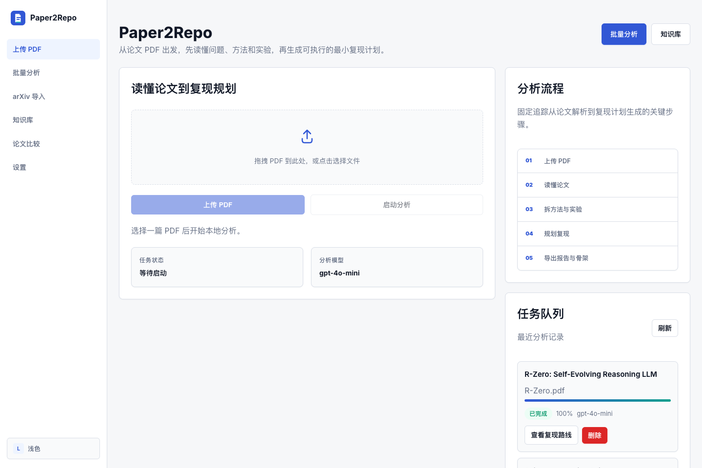
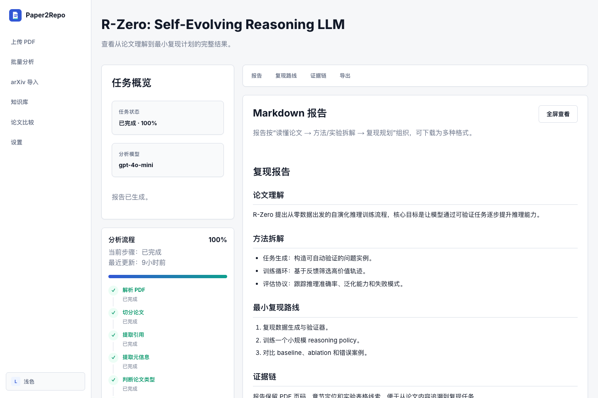

# Paper2Repo

Turn AI papers into evidence-grounded reports, experiment audits, reproduction plans, Q&A, and code skeletons.

[](https://github.com/Jiaobin-1/Paper2Repo/actions/workflows/ci.yml)


## 中文简介

Paper2Repo 是我在学习 AI Agent 工作流时做的本地优先开源项目。它不是简单的论文总结器，而是把 AI 论文拆成一条更接近真实复现的流程：**读懂论文 -> 审计方法和实验 -> 规划复现**。

输入 PDF 或 arXiv 论文后，它会生成结构化理解报告、实验细节审计、缺失信息提示、复现风险清单、checklist 和最小代码骨架计划。开发过程中，我使用 Codex 辅助实现、调试和整理文档。

## Highlights

- **Reproduction-first:** built for paper understanding, method audit, experiment audit, and reproduction planning, not generic summarization.
- **Local-first:** FastAPI + Next.js + LangGraph + SQLite, with Docker Compose for quick local trials.
- **No API key required:** deterministic fallbacks work out of the box; `OPENAI_API_KEY` enables richer model-assisted analysis and Q&A.

## Quick Start

### Docker

```bash
cp .env.example .env
docker compose up --build
```

Open `http://localhost:3000`.

The Docker setup starts the FastAPI backend, Next.js frontend, and local SQLite storage. Leaving `OPENAI_API_KEY` empty is supported: the app still parses PDFs, runs deterministic evidence-based fallbacks, generates reports, and passes integration tests.

### Manual Development

Backend:

```bash
cp .env.example .env
cd backend
pip install -r requirements.txt
pip install -r requirements-dev.txt
python -m uvicorn app.main:app --reload
```

Frontend:

```bash
cd frontend
npm ci
npm run dev
```

Health check:

```bash
curl http://127.0.0.1:8000/health
```

## Interface Preview

### Agent Workspace



### Report and Reproduction View



## What It Does

| Capability | Output |
| --- | --- |
| Paper understanding | Background, core problem, contributions, assumptions, limitations |
| Method and experiment audit | Modules, datasets, metrics, baselines, protocols, missing details |
| Reproduction planning | Minimum reproduction goal, scope, risks, checklist, code skeleton |
| Local workspace features | Batch analysis, arXiv import, Q&A, citations, knowledge search, comparison |

## Why Not Just Use a PDF Summarizer?

| Tool type | Typical output | Paper2Repo output |
| --- | --- | --- |
| PDF chat | Answers to ad hoc questions | A persistent paper workspace with reports, Q&A, exports, and searchable evidence |
| Paper summarizer | Background, method, contributions | Understanding plus method modules, experiment protocols, missing details, and limitations |
| Agent notebook | Free-form analysis | A structured `read paper -> audit method and experiments -> plan reproduction` workflow |
| Code generator | Draft code from a prompt | Reproduction scope, acceptance criteria, risks, and a minimal code skeleton with TODOs |

## Workflow

```text
PDF / arXiv
  -> parse and chunk paper
  -> extract citations and metadata
  -> understand paper
  -> analyze method and experiments
  -> plan reproduction
  -> export report and code skeleton
```

## Configuration

| Variable | Description | Default |
| --- | --- | --- |
| `OPENAI_API_KEY` | Optional OpenAI-compatible API key | empty |
| `OPENAI_BASE_URL` | Chat API base URL | `https://api.openai.com/v1` |
| `OPENAI_MODEL` | Default model for new runs | `gpt-4o-mini` |
| `OPENAI_MODEL_OPTIONS` | Comma-separated model options | `gpt-4o-mini,gpt-4o,deepseek-chat` |
| `OPENAI_TIMEOUT_SECONDS` | LLM request timeout | `60` |
| `DATABASE_URL` | SQLite database URL | `sqlite:///./data/paper2repo.db` |
| `UPLOAD_MAX_MB` | Single upload size limit | `50` |

Leaving `OPENAI_API_KEY` empty is supported. The app still parses PDFs, runs local evidence-based fallbacks, generates reports, and passes the integration tests.

## Project Structure

```text
Paper2Repo/
├── backend/      FastAPI, LangGraph workflow, SQLite persistence
├── frontend/     Next.js app, report UI, settings, batch tools
├── docs/         API, architecture notes, sample report
└── .github/      CI workflow
```

## Documentation

- [API reference](docs/api.md)
- [Architecture](docs/architecture.md)
- [Sample report](docs/examples/sample_report.md)

## Development

```bash
cd backend
python -m ruff check app tests
python -m mypy app --ignore-missing-imports
python -m pytest tests -q

cd ../frontend
npm run lint
npm run test:unit
npm run build
npm run test:e2e
```

Current local verification baseline:

- `pytest`: 176 tests
- `vitest`: 34 tests
- `Playwright`: 21 tests

## Repository Hygiene

Do not commit `.env`, local SQLite databases, uploaded PDFs, generated reports, `.next`, cache folders, Playwright reports, or local document drafts. Use `.env.example` as the public configuration template.

## License

MIT
