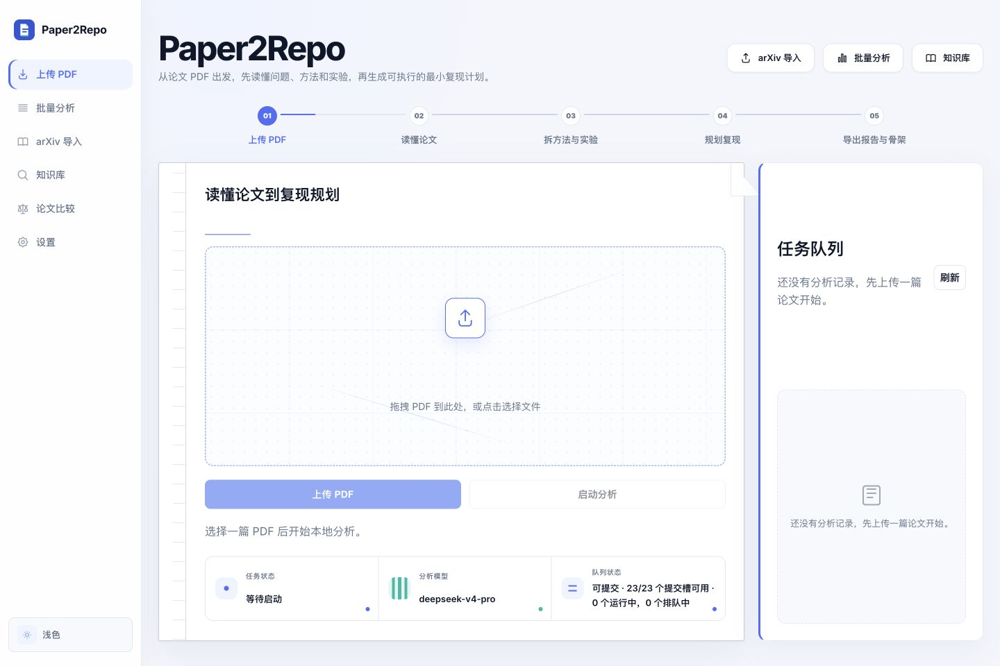
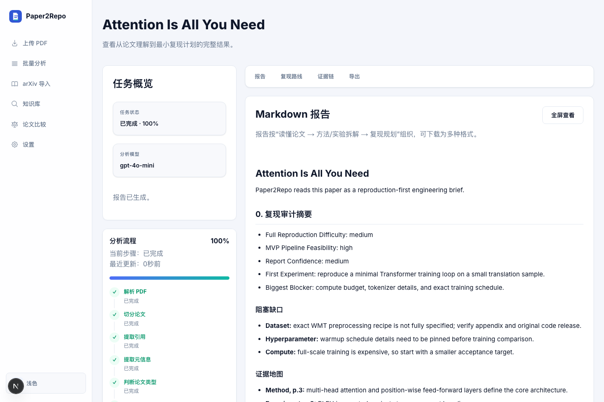

# Paper2Repo

Turn AI papers into evidence-grounded reports, experiment audits, reproduction plans, Q&A, and code skeletons.

[](https://github.com/Jiaobin-1/Paper2Repo/actions/workflows/ci.yml)


Paper2Repo reads papers with reproduction in mind. Upload a PDF or import an arXiv paper, then get a structured report that connects paper understanding, method and experiment details, missing reproduction information, risks, and a minimal code skeleton plan.

## Highlights

- **Reproduction-first:** built for paper understanding, method audit, experiment audit, and reproduction planning, not generic summarization.
- **Local-first:** FastAPI + Next.js + LangGraph + SQLite, with Docker Compose for quick local trials.
- **Agent workflow:** LangGraph coordinates parsing, evidence extraction, structured analysis, report generation, and Q&A.
- **Quality-gated:** report structure, evidence coverage, export routes, and upload-to-report flows are covered by backend and browser tests.

## Quick Start

### Docker

```bash
cp .env.example .env
docker compose up --build
```

Open `http://localhost:3000`.

The Docker setup starts the FastAPI backend, Next.js frontend, and local SQLite storage.

### Manual Development

Backend:

```bash
cp .env.example .env
cd backend
pip install -r requirements.txt
pip install -r requirements-dev.txt
python -m uvicorn app.main:app --reload
```

Frontend:

```bash
cd frontend
npm ci
npm run dev
```

Health check:

```bash
curl http://127.0.0.1:8000/health
```

## Interface Preview

### Agent Workspace



### Report and Reproduction View



## What It Does

| Capability | Output |
| --- | --- |
| Paper understanding | Background, core problem, contributions, assumptions, limitations |
| Method and experiment audit | Modules, datasets, metrics, baselines, protocols, missing details |
| Reproduction planning | Minimum reproduction goal, scope, risks, checklist, code skeleton |
| Local workspace features | Batch analysis, arXiv import, Q&A, citations, knowledge search, comparison |
| Workspace maintenance | Delete papers and clean related runs, reports, chunks, embeddings, citations, Q&A, and local files |

## Why Not Just Use a PDF Summarizer?

| Tool type | Typical output | Paper2Repo output |
| --- | --- | --- |
| PDF chat | Answers to ad hoc questions | A persistent paper workspace with reports, Q&A, exports, and searchable evidence |
| Paper summarizer | Background, method, contributions | Understanding plus method modules, experiment protocols, missing details, and limitations |
| Agent notebook | Free-form analysis | A structured `read paper -> audit method and experiments -> plan reproduction` workflow |
| Code generator | Draft code from a prompt | Reproduction scope, acceptance criteria, risks, and a minimal code skeleton with TODOs |

## Workflow

```text
PDF / arXiv
  -> parse and chunk paper
  -> extract citations and metadata
  -> understand paper
  -> analyze method and experiments
  -> plan reproduction
  -> export report and code skeleton
```

## Local Data Management

Paper2Repo stores uploaded PDFs, generated Markdown reports, analysis JSON, chunks, embeddings, citations, and Q&A history locally. Completed or failed papers can be deleted from the API; deletion removes the paper, its analysis runs, stored knowledge artifacts, generated reports, and local upload/report files. Papers with pending or running analyses are protected from deletion until the analysis finishes or fails.

## Configuration

| Variable | Description | Default |
| --- | --- | --- |
| `OPENAI_API_KEY` | OpenAI-compatible API key for model-assisted analysis | not set |
| `OPENAI_BASE_URL` | Chat API base URL | `https://api.openai.com/v1` |
| `OPENAI_MODEL` | Default model for new runs | `gpt-4o-mini` |
| `OPENAI_MODEL_OPTIONS` | Comma-separated model options | `gpt-4o-mini,gpt-4o,deepseek-chat` |
| `OPENAI_TIMEOUT_SECONDS` | LLM request timeout | `60` |
| `LLM_INPUT_COST_PER_MILLION` | Input-token price used for cost estimates | `0` |
| `LLM_OUTPUT_COST_PER_MILLION` | Output-token price used for cost estimates | `0` |
| `API_AUTH_TOKEN` | Optional Bearer token for proxy-fronted/programmatic `/api/*` access | not set |
| `DATABASE_URL` | SQLite database URL | `sqlite:///./data/paper2repo.db` |
| `UPLOAD_MAX_MB` | Single upload size limit | `50` |
| `PDF_MAX_PAGES` | Maximum pages parsed from one PDF | `300` |
| `PDF_OCR_ENABLED` | OCR sparse/scanned pages when local Tesseract support is available | `true` |
| `PDF_EXTRACT_TABLES` | Add detected tables to retrieval chunks | `true` |
| `PDF_EXTRACT_FORMULAS` | Add formula-like lines to retrieval chunks | `true` |
| `ANALYSIS_MAX_WORKERS` | Shared worker limit for all analysis runs | `3` |
| `ANALYSIS_MAX_QUEUED_JOBS` | Maximum waiting jobs beyond active workers | `20` |
| `ANALYSIS_JOB_LEASE_SECONDS` | Worker lease before an interrupted job can be reclaimed | `3600` |
| `ANALYSIS_RECOVERY_INTERVAL_SECONDS` | Periodic interrupted-job recovery interval | `30` |
| `STORAGE_CLEANUP_MIN_AGE_HOURS` | Minimum age before unreferenced upload/report files are cleanup candidates | `24` |

## Project Structure

```text
Paper2Repo/
├── backend/
│   ├── app/api/         FastAPI route modules and aggregated API router
│   ├── app/agents/      LangGraph workflow and analysis nodes
│   ├── app/core/        app lifecycle, settings, SQLite persistence
│   ├── app/services/    parsing, retrieval, export, and LLM services
│   └── tests/           backend API and workflow coverage
├── frontend/
│   ├── app/             Next.js routes and page entrypoints
│   ├── components/      reusable UI grouped by feature
│   ├── hooks/           UI state hooks for language and theme
│   └── lib/             API client, types, i18n, polling, formatting
├── docs/                API, architecture notes, sample report
└── .github/             CI workflow
```

## Documentation

- [API reference](docs/api.md)
- [Architecture](docs/architecture.md)
- [Sample report](docs/examples/sample_report.md)

## Development

```bash
cd backend
python -m ruff check app tests scripts
python -m mypy app --ignore-missing-imports
python -m pytest tests -q
python -m scripts.run_quality_benchmark

cd ../frontend
npm run lint
npm run test:unit
npm run build
npm run test:e2e
```

Current local verification baseline:

- `pytest`: 242 tests
- `vitest`: 43 tests
- `Playwright`: 22 mocked UI tests plus 1 real frontend-backend flow

Run the real full-stack flow locally with a Python environment that has the backend dependencies installed:

```bash
cd frontend
npm run test:e2e:fullstack
```

If the backend dependencies live in the documented Conda environment, set
`FULLSTACK_BACKEND_COMMAND="conda run -n agent-learning python -m uvicorn app.main:app --host 127.0.0.1 --port 8000"`.

The deterministic quality benchmark uses the local fallback pipeline and exits non-zero when a checked-in paper case falls below its configured score. It now checks report quality signals such as evidence coverage, low-confidence items, and fallback-template usage. Add cases in `backend/benchmarks/quality_cases.json` as report expectations mature.

The Settings page exposes local storage usage and can clean orphan upload/report files that are no longer referenced by SQLite and are older than `STORAGE_CLEANUP_MIN_AGE_HOURS`.

`API_AUTH_TOKEN` is opt-in. Leave it empty for the local browser UI. When set, every `/api/*` request must send `Authorization: Bearer <token>`; this mode is intended for a reverse proxy that injects the header or for programmatic clients, because ordinary browser download links cannot attach it.

Docker includes English and Simplified Chinese Tesseract data. Manual installations need a local Tesseract runtime for OCR; set `PDF_OCR_LANGUAGE=eng+chi_sim` when both languages are required. OCR failure never blocks native PDF text extraction.

Quality coverage includes report quality gates, export route checks, database cleanup checks, and a browser-level upload -> analysis -> report rendering flow.

## Repository Hygiene

Do not commit `.env`, local SQLite databases, uploaded PDFs, generated reports, `.next`, cache folders, Playwright reports, or local document drafts. Use `.env.example` as the public configuration template.

## License

MIT
